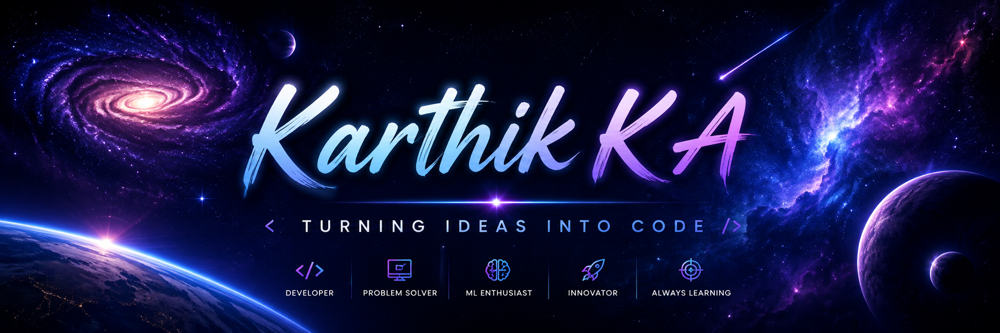

<!-- ======================= HEADER ======================= -->

  

<h1 align="center">Hi 👋, I'm Karthik K A</h1>

  

  <i>Passionate about building software, exploring AI, and continuously learning new technologies.</i>

---

# 👨‍💻 About Me

- 🎓 Computer Science Student
- 🌱 Currently learning **Machine Learning, Computer Vision & Full Stack Development**
- 💻 Passionate about Software Development
- 🚀 Love building real-world applications
- 📚 Always exploring new technologies
- ⚡ **Fun Fact:** Most of my coding sessions start with curiosity and end with learning something new.

---
# 🛠️ Languages & Tools

  

---

# 🌐 Connect With Me

&nbsp;&nbsp;&nbsp;
&nbsp;&nbsp;&nbsp;

---

# 🔥 GitHub Streak

  

---

# 📈 Contribution Graph

  

---

# 🎯 Current Goals

- 🌱 Master Machine Learning
- 👁️ Learn Computer Vision
- 🌐 Become a Full Stack Developer
- 🚀 Build impactful real-world projects
- 💡 Contribute more to Open Source

 ---

  

  

